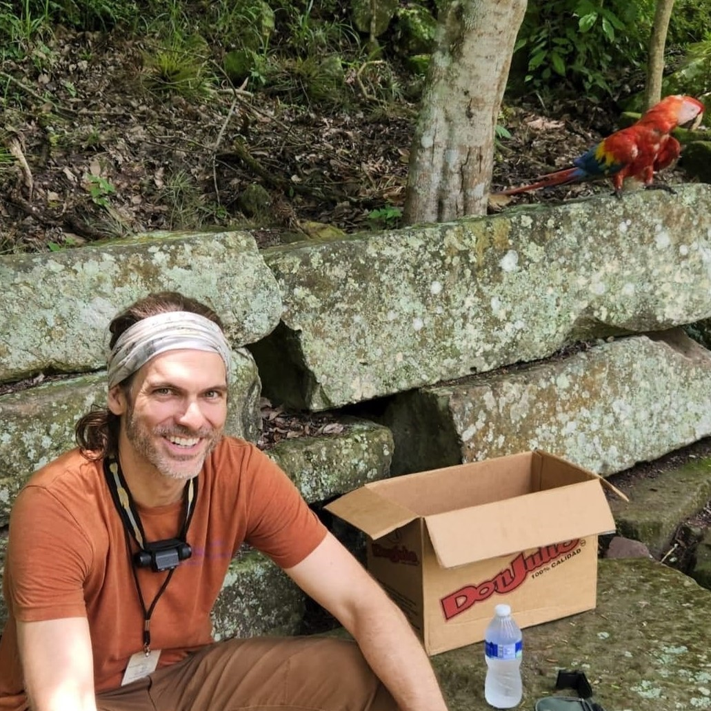

# Chris J. Ploetz Centered Academic Website

This version is designed to feel closer to a clean academic faculty website:
centered name/title, green navigation bar, large homepage image, and a lower bio/headshot section.

## Files to upload to GitHub

Upload all files and the assets folder to the root of your GeoPloetz.github.io repository.

## Add homepage image

Place a wide image at:

assets/homepage.jpg

Then replace the hero placeholder in index.html with:

<section class="hero has-image">
  
</section>

## Add headshot

Place a square/portrait image at:

assets/headshot.jpg

Then replace the headshot placeholder in index.html with:

